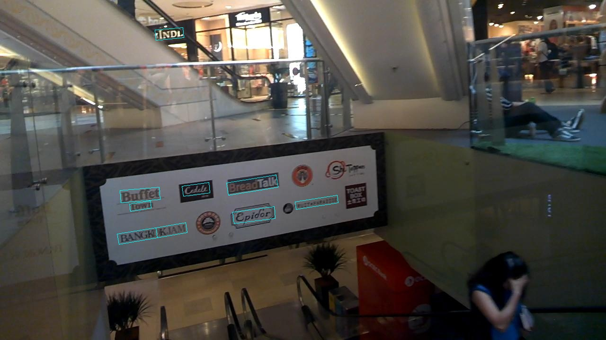

# OCR detection for ICDAR2015, which is based on FOTS detection algorithm.

## Introduction

This project is a  pytorch implementation of fots detection for OCR, and we focus on achieved the detection algorithm only:[paper link-FOTS: Fast Oriented Text Spotting with a Unified Network](https://arxiv.org/abs/1801.01671). The code is created by [Ning Lu](https://github.com/jiangxiluning) originally, and we would like to appreaciate to his contributions.

### What we are doing and going to do

- [x] Change some code to make the project work.
- [x] Add PSPnet model to experiment, but is not work effectively(the another project that we have doing: [code](https://github.com/Vipermdl/PyTorch-PSPNet-master)).
- [x] Support visdom.
- [x] Support pytorch-0.4.1 or higher.

## Benchmarking

We benchmark our code thoroughly on the dataset: ICDAR2015, using network architecture: resnet50. It's worth noting that, the project had used the multi-scale to train network and haven't done the skill of OHEM. Below are the results:

1). ICDAR2015 (scale=512):

| model | #GPUs | batch size | lr | Recall | Precision | Hmean | 
| - | :-: | :-: | :-: | :-: | :-: | :-: | 
|[Res-50](https://github.com/KaimingHe/deep-residual-networks) | 1080Ti | 4 | 1e-3 | 69.72% | 80.09% | 74.54% | 

## Preparation

First of all, clone the code
```
git clone https://github.com/Vipermdl/OCR_detection_IC15
```

### prerequisites

* Python 3.6
* Pytorch 0.4.1
* CUDA 8.0 or higher

### Data Preparation

* **ICDAR 2015**: Please download the dataset in the folder in your project named dataset, you can refer to any others. After downloading the data, creat softlinks in the folder data/.

### Compilation

Install all the python dependencies using pip:
```
pip install -r requirements.txt
```

## Train

Try:
```
python train.py 
```

## Test

If you want to evlauate the detection performance, simply run
```
python eval.py 
```

Below are some detection results:

<div style="color:#0000FF" align="center">
 
</div>

## Authorship

This project is equally contributed by [Ning Lu](https://github.com/jiangxiluning) and [DongLiang Ma](https://vipermdl.github.io/), and many others (thanks to them!).
